# Animation Style Prompts · 50 种 AI 动画美学

说出动画风格，直接获得提示词；描述用途和视觉偏好，获得风格推荐及提示词。每种风格包含画面参考和中英文通用美学提示词。**来源：网络。**

## 一条命令安装

需要 Node.js / npm 和支持 Agent Skills 的 AI 助手。安装到全局，供工具发现与调用：

```bash
npx skills add cooperchx/animation-style-prompts --skill animation-style-prompts -g -y
```

也可以把 [skills/animation-style-prompts](skills/animation-style-prompts) 整个文件夹放入你的助手支持的 skills 目录。

## 直接调用

```text
$animation-style-prompts 给我黏土动画风格的提示词。
$animation-style-prompts 用皮克斯风写一个机器人园丁的动画提示词。
$animation-style-prompts 我要做温暖治愈的儿童短片，推荐风格并给提示词。
$animation-style-prompts 推荐一种复古、单色、纸张质感的动画风格。
```

安装后也可直接用自然语言表达需求。是否自动触发由助手的技能加载机制决定；使用 `$animation-style-prompts` 可以显式调用。

## 使用方式

- **指定风格**：按中文、英文或常见别名匹配，直接输出可复制的中英文提示词和负面词。
- **描述需求**：推荐最多 3 个有区别的风格，简述适合原因，并提供提示词。
- **提供题材**：保留用户给出的内容，将风格模板套入该题材；没有题材时只提供美学模板。

提示词保留材质、线条、比例、色板、光影和动画质感，不绑定参考图中的人物、地点或故事。画面参考用于理解视觉特征；实际生成效果取决于使用的模型和参数。此 Skill 输出文本，不需要 API Key，不自动生成图片或视频。

## 50 种风格与画面参考

点击风格名称查看中英文提示词。

| 编号 | 画面参考 | 风格 |
| --- | --- | --- |
| 01 | 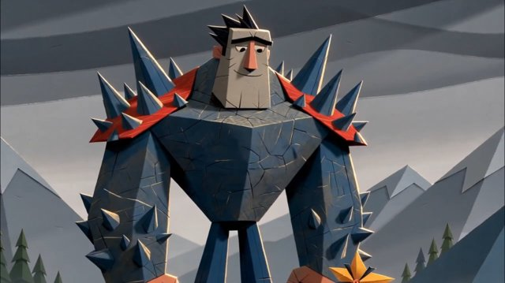 | [Paper-Craft Illustration（纸艺插画）](skills/animation-style-prompts/references/styles/01.md) |
| 02 | 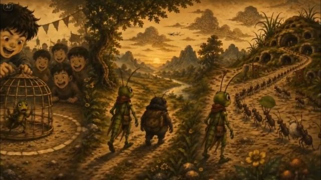 | [Vietnamese folk-art inspired style（越南民间艺术）](skills/animation-style-prompts/references/styles/02.md) |
| 03 | 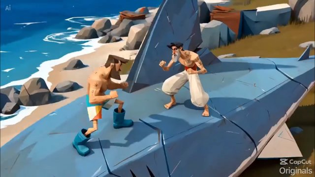 | [Stylized low-poly illustration blended with multiple styles（风格化低多边形 + 混合）](skills/animation-style-prompts/references/styles/03.md) |
| 04 | 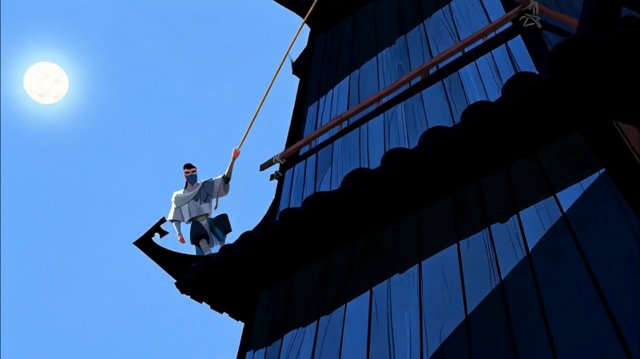 | [Chinese Mythical Fantasy Animation（中国神话奇幻动画）](skills/animation-style-prompts/references/styles/04.md) |
| 05 |  | [Minimalist Cozy Slice-of-Life Illustration（极简温馨日常插画）](skills/animation-style-prompts/references/styles/05.md) |
| 06 |  | [Whimsical storybook illustration（奇趣绘本插画）](skills/animation-style-prompts/references/styles/06.md) |
| 07 | 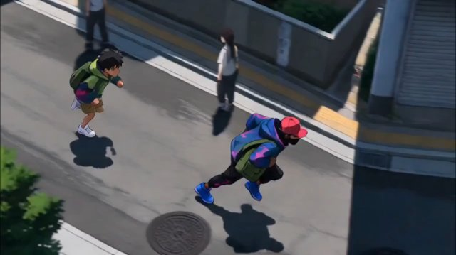 | [Stylized Japanese anime concept art（风格化日式动漫概念艺术）](skills/animation-style-prompts/references/styles/07.md) |
| 08 | 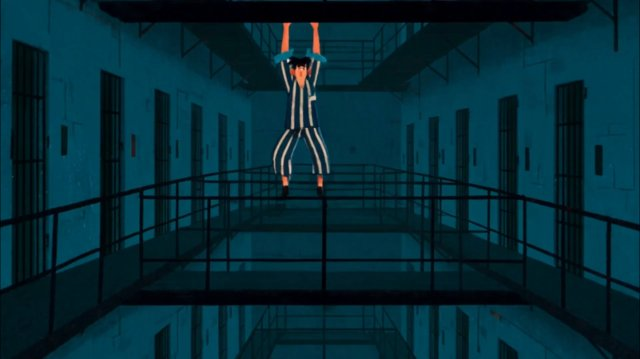 | [Retro Editorial Cartoon / Mid-Century Storybook Illustration（复古社论漫画 / 世纪中期绘本）](skills/animation-style-prompts/references/styles/08.md) |
| 09 | 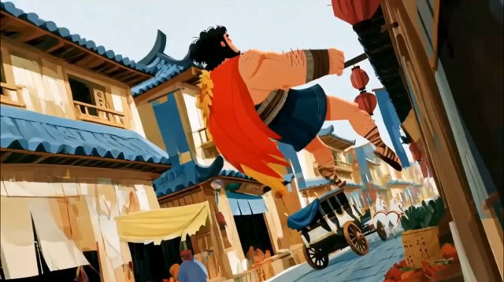 | [Stylized 2D hand-painted storybook animation, modern Western character design, gouache（风格化 2D 手绘绘本动画，水粉质感）](skills/animation-style-prompts/references/styles/09.md) |
| 10 | 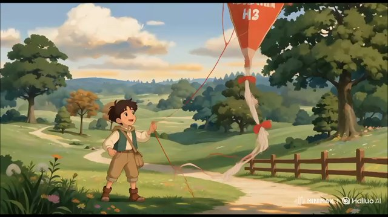 | [日式手绘长片动画风（Japanese Hand-Painted Feature Animation）](skills/animation-style-prompts/references/styles/10.md) |
| 11 | 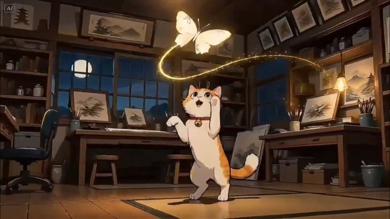 | [Modern Ukiyo-e Illustration（现代浮世绘）](skills/animation-style-prompts/references/styles/11.md) |
| 12 | 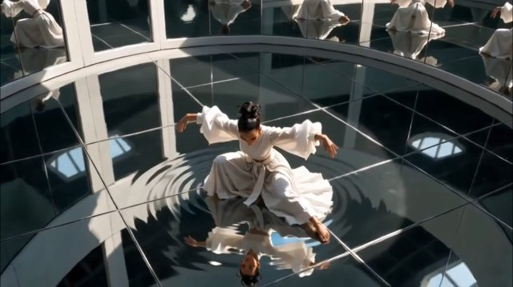 | [Painterly Cinematic Concept Art（绘画感电影概念艺术）](skills/animation-style-prompts/references/styles/12.md) |
| 13 | 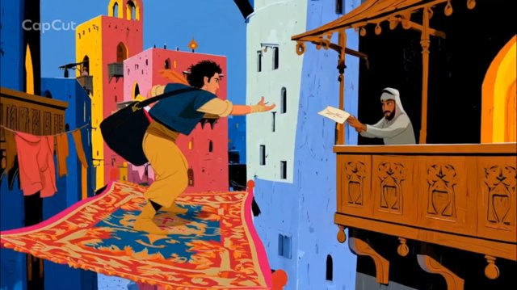 | [Stylized Arabian Folk Art / Modernist Storybook（阿拉伯民间艺术 / 现代主义绘本）](skills/animation-style-prompts/references/styles/13.md) |
| 14 | 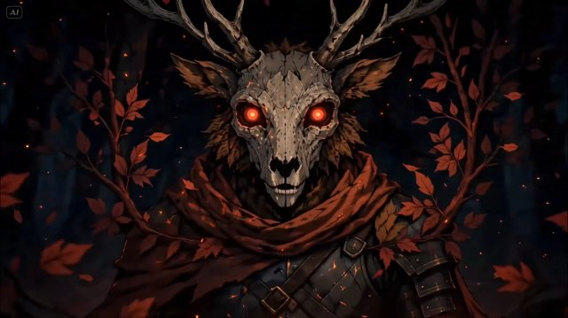 | [Dark Medieval Fantasy（黑暗中世纪奇幻）](skills/animation-style-prompts/references/styles/14.md) |
| 15 |  | [Painterly Storybook Fantasy（绘画感绘本奇幻）](skills/animation-style-prompts/references/styles/15.md) |
| 16 |  | [Stylized Graphic Editorial Illustration（风格化平面社论插画）](skills/animation-style-prompts/references/styles/16.md) |
| 17 | 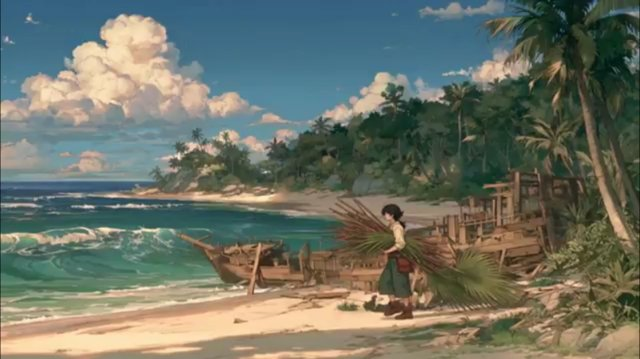 | [Art Nouveau Manga Fusion（新艺术运动 × 漫画融合）](skills/animation-style-prompts/references/styles/17.md) |
| 18 | 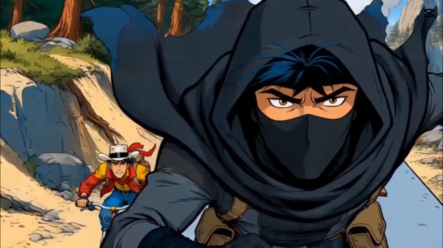 | [Franco-Belgian comics（法比漫画）](skills/animation-style-prompts/references/styles/18.md) |
| 19 | 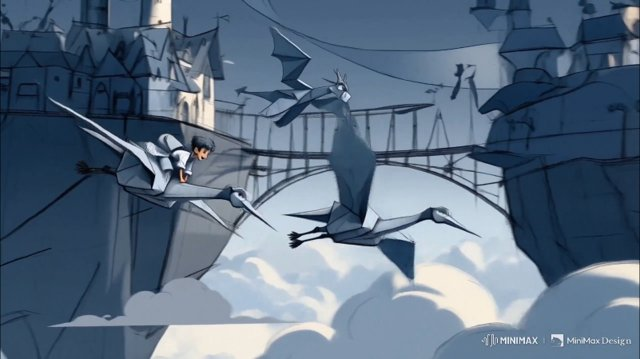 | [Rough Blue-Pencil Animation Concept Art（蓝铅笔草稿动画概念稿）](skills/animation-style-prompts/references/styles/19.md) |
| 20 | 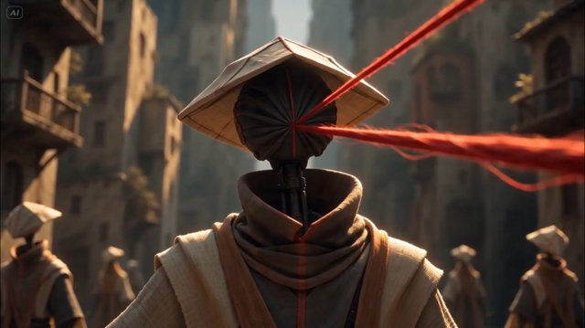 | [Gothic Monolith（哥特巨石风）](skills/animation-style-prompts/references/styles/20.md) |
| 21 | 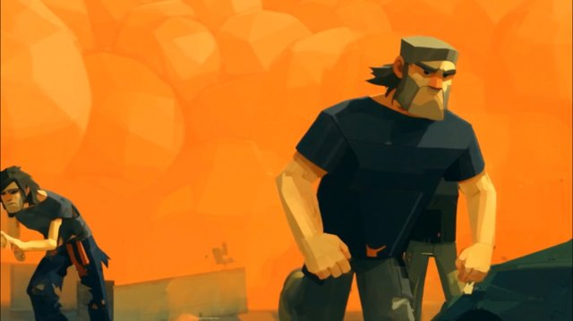 | [Painterly Low-Poly Comic Art（绘画感低多边形漫画）](skills/animation-style-prompts/references/styles/21.md) |
| 22 |  | [Anime（动漫风）](skills/animation-style-prompts/references/styles/22.md) |
| 23 | 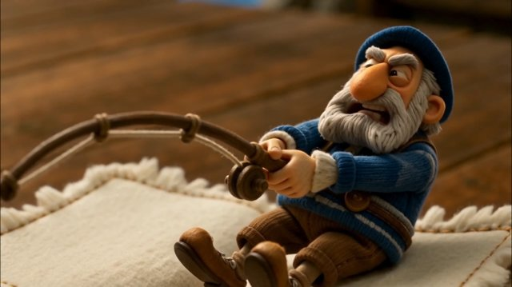 | [Handmade Needle-Felt Fantasy（手工羊毛毡奇幻）](skills/animation-style-prompts/references/styles/23.md) |
| 24 |  | [1990s American superhero cartoon（90 年代美式超英动画）](skills/animation-style-prompts/references/styles/24.md) |
| 25 | 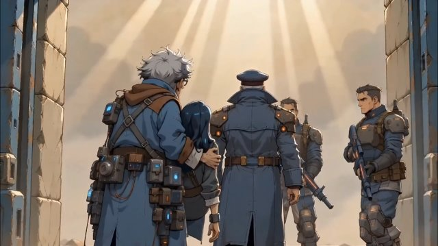 | [Stylized Sci-Fi Concept Art / Graphic-Novel + Anime + Western Comic + Dieselpunk/Cyberpunk（科幻概念艺术混合柴油朋克/赛博朋克）](skills/animation-style-prompts/references/styles/25.md) |
| 26 |  | [Whimsical hand-drawn fantasy concept art, ink and watercolor illustration（奇趣手绘奇幻概念艺术，墨水 + 水彩）](skills/animation-style-prompts/references/styles/26.md) |
| 27 | 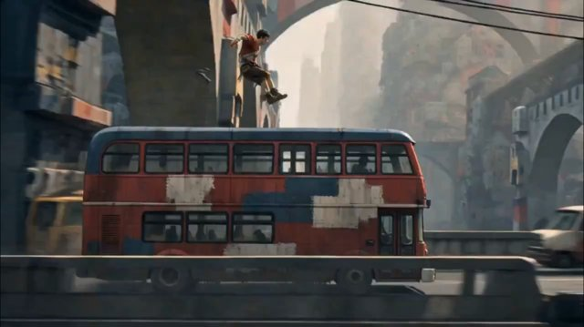 | [Architectural Expressionism（建筑表现主义，现代德国表现主义）](skills/animation-style-prompts/references/styles/27.md) |
| 28 | 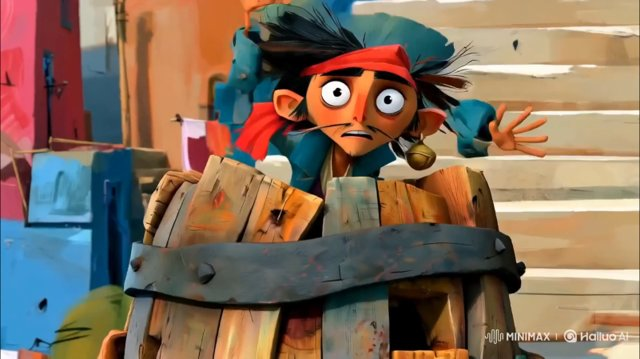 | [Whimsical hand-painted storybook, exaggerated caricature proportions, gouache（奇趣手绘绘本 + 夸张漫画比例）](skills/animation-style-prompts/references/styles/28.md) |
| 29 | 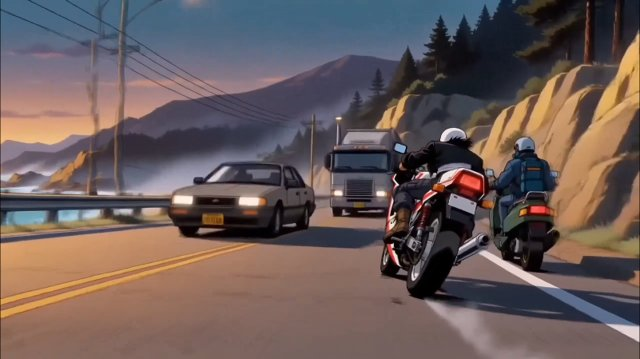 | [90s anime style（90 年代动漫）](skills/animation-style-prompts/references/styles/29.md) |
| 30 |  | [Stylized 3D Animated Feature Film（风格化 3D 动画长片）](skills/animation-style-prompts/references/styles/30.md) |
| 31 | 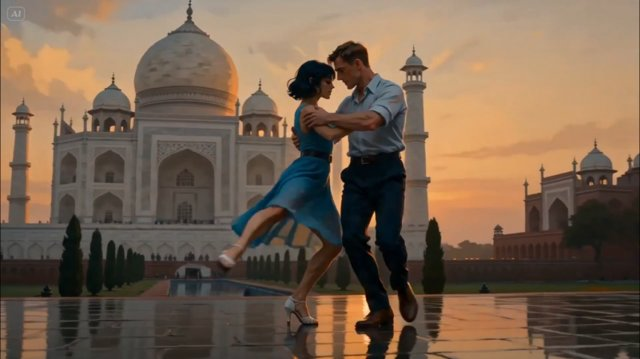 | [Digital Oil Painting（数字油画）](skills/animation-style-prompts/references/styles/31.md) |
| 32 |  | [Mid-Century Modern Editorial Illustration, Geometric Character Design（世纪中期现代社论插画 + 几何角色）](skills/animation-style-prompts/references/styles/32.md) |
| 33 | 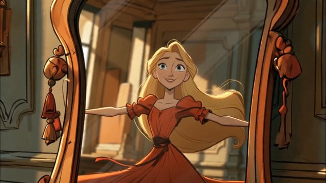 | [Classic European fairy tale illustration（经典欧洲童话插画）](skills/animation-style-prompts/references/styles/33.md) |
| 34 | 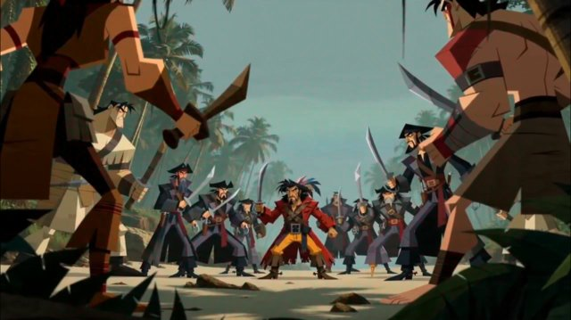 | [Genndy Tartakovsky's style（Genndy Tartakovsky 风）](skills/animation-style-prompts/references/styles/34.md) |
| 35 | 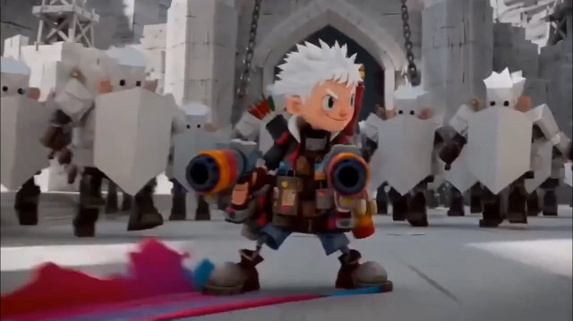 | [混合媒介：3D 玩具 × 纸艺（3D Vinyl Toy × Papercraft）](skills/animation-style-prompts/references/styles/35.md) |
| 36 | 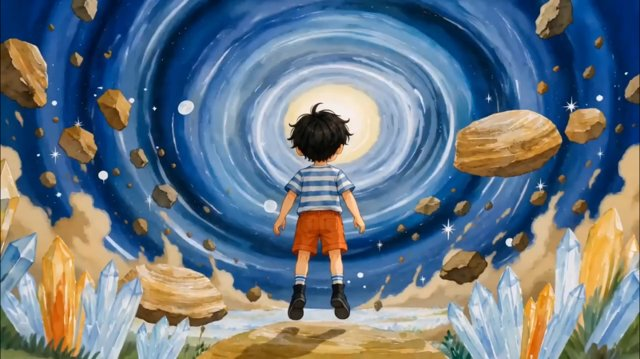 | [Whimsical Watercolor Storybook（奇趣水彩绘本）](skills/animation-style-prompts/references/styles/36.md) |
| 37 | 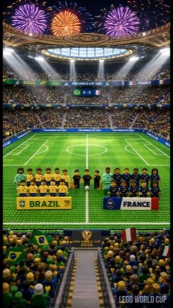 | [LEGO（乐高积木）](skills/animation-style-prompts/references/styles/37.md) |
| 38 | 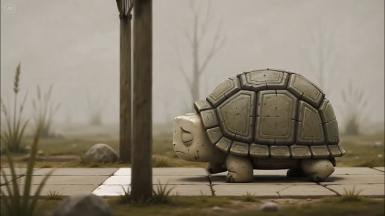 | [Stylized 3D Storybook（风格化 3D 绘本）](skills/animation-style-prompts/references/styles/38.md) |
| 39 |  | [Children's storybook / Warm Scandinavian Folk Illustration（温暖北欧民间绘本）](skills/animation-style-prompts/references/styles/39.md) |
| 40 |  | [Hand-drawn sketch（手绘素描）](skills/animation-style-prompts/references/styles/40.md) |
| 41 | 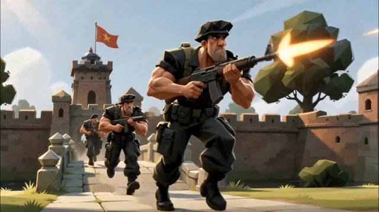 | [Stylized Military Concept Art（风格化军事概念艺术）](skills/animation-style-prompts/references/styles/41.md) |
| 42 |  | [Black-and-white ink illustration + Tim Burton-inspired proportions（黑白墨线 + 蒂姆·伯顿式比例）](skills/animation-style-prompts/references/styles/42.md) |
| 43 | 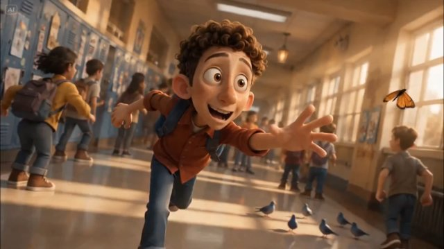 | [Pixar style（皮克斯风）](skills/animation-style-prompts/references/styles/43.md) |
| 44 | 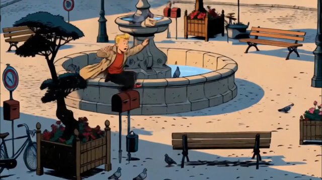 | [Ligne claire（清线派）](skills/animation-style-prompts/references/styles/44.md) |
| 45 | 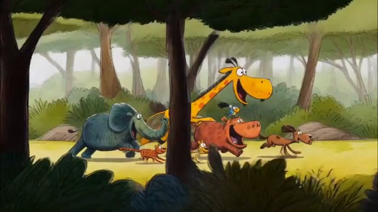 | [Kids' drawing style（儿童涂鸦画风）](skills/animation-style-prompts/references/styles/45.md) |
| 46 | 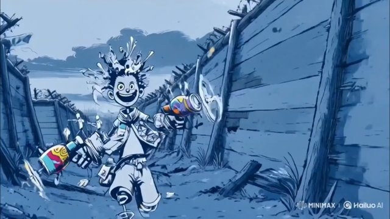 | [Pen-and-ink sketch（钢笔墨水素描）](skills/animation-style-prompts/references/styles/46.md) |
| 47 | 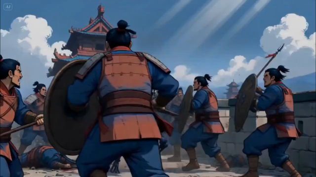 | [Stylized Digital Painting（风格化数字绘画）](skills/animation-style-prompts/references/styles/47.md) |
| 48 | 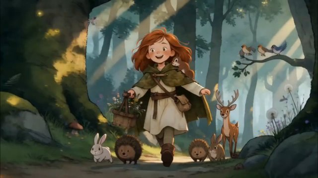 | [Cartoon Saloon（卡通沙龙工作室风 / 欧洲绘本）](skills/animation-style-prompts/references/styles/48.md) |
| 49 |  | [Anime Cinematic Style（电影感动漫）](skills/animation-style-prompts/references/styles/49.md) |
| 50 | 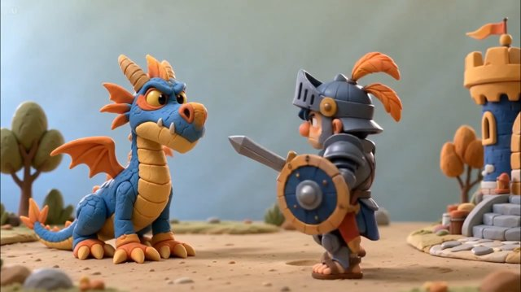 | [Claymation Art（黏土动画）](skills/animation-style-prompts/references/styles/50.md) |
