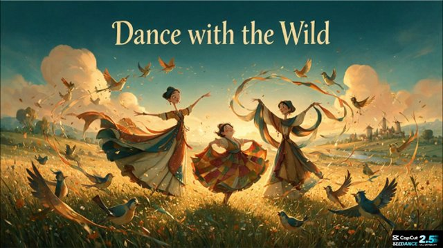

# Whimsical storybook illustration（奇趣绘本插画）

来源：网络

## 画面参考



## 美学提示词（英文）

```text
Whimsical painterly storybook illustration, rich gouache-like brushwork with soft textured edges, warm glowing light, elongated stylised figures with long necks, small heads and expressive graceful poses.
Palette: #D9A441, #2F5E66, #F2D8A7, #B4532E, #3A4F7A.
Golden backlight and soft glow, spacious sweeping compositions, smooth camera arcs, graceful flowing motion and joyful mood.
Negative: 3D render, photoreal, flat vector, harsh outlines, dark gloomy palette.
```

## 美学提示词（中文）

```text
奇趣绘画感绘本插画：丰富的类水粉笔触，边缘带柔和纹理，温暖发光的光线，拉长的风格化人物，长脖子、小脑袋、优雅而有表现力的姿态。
色板：#D9A441、#2F5E66、#F2D8A7、#B4532E、#3A4F7A。
金色逆光与柔和辉光、开阔横扫构图、平滑弧形运镜、优雅流动动作与欢庆气质。
负面词：3D 渲染、照片写实、扁平矢量、生硬描边、阴暗沉闷色调。
```
