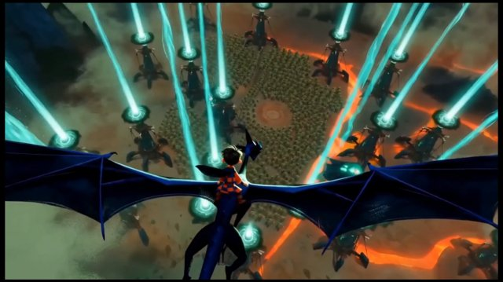

# 绘画感 3D 奇幻动画风（Painterly 3D Fantasy Animation Style）

来源：网络

## 画面参考



## 美学提示词（英文）

```text
Painterly storybook fantasy with a stylised 3D feature-animation finish: soft painted textures over sculpted forms, chunky readable silhouettes, slightly exaggerated cartoon proportions, cinematic depth.
Palette: #1E2A4A, #F06A2A, #46D6E8, #6E9A3A, #6A5A4A.
Cool luminous accents versus hot warm light, volumetric haze, cinematic depth, sweeping camera motion and epic storybook energy.
Negative: flat 2D vector, photoreal creatures, pastel palette, gore.
```

## 美学提示词（中文）

```text
绘画感绘本奇幻配风格化 3D 长片动画完成度：雕塑形体上覆盖柔和绘画纹理，厚实易读的剪影，略带夸张的卡通比例，电影般纵深。
色板：#1E2A4A、#F06A2A、#46D6E8、#6E9A3A、#6A5A4A。
冷发光点缀对比炽热暖光、体积雾、电影纵深、横扫运镜与史诗绘本张力。
负面词：扁平 2D 矢量、写实生物、粉彩色调、血腥。
```
