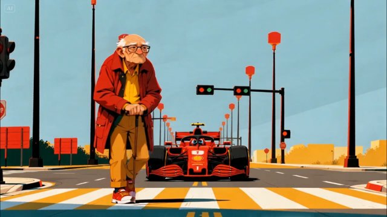

# 平面印刷插画风（Graphic Print Illustration Style）

来源：网络

## 画面参考



## 美学提示词（英文）

```text
Stylized graphic editorial illustration, flat screen-print look with crisp hard-edged colour shapes, minimal soft gradients, subtle grain, thin dark outlines only on key forms, strong one-point perspective.
Palette: #A9C8D8, #D3382B, #E3A73B, #3E4A57, #F2EFE6.
Bright flat illumination, strong one-point perspective, centered symmetry, minimal shading and deadpan comic rhythm.
Negative: painterly brushwork, photoreal, 3D, anime, dark moody lighting.
```

## 美学提示词（中文）

```text
风格化平面社论插画：扁平丝网印刷感，清晰硬边色块，极少的柔和渐变，细微颗粒，只在关键形体上用细深色描边，强烈的一点透视。
色板：#A9C8D8、#D3382B、#E3A73B、#3E4A57、#F2EFE6。
明亮平光、强一点透视、居中对称、极少阴影与冷面喜剧节奏。
负面词：绘画笔触、照片写实、3D、日漫、阴暗情绪光。
```
