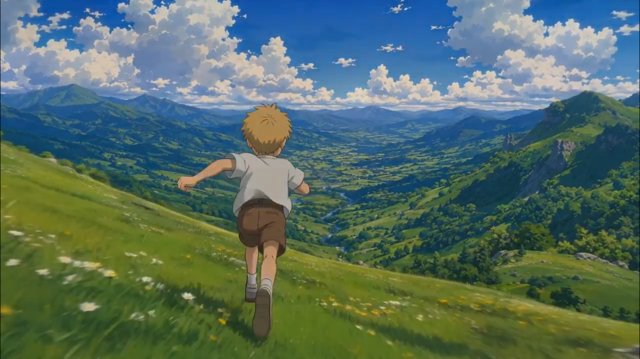

# 吉卜力动画风格（Studio Ghibli Animation Style）

来源：网络

## 画面参考



## 美学提示词（英文）

```text
Cinematic hand-painted anime film style: lush painterly gouache background art, sculptural volumes and layered atmospheric depth; clean thin character linework, soft two-tone cel shading, simple rounded faces and naturalistic proportions.
Palette: #3E7BD6, #6FA83A, #F2A65A, #6B5A8E.
Warm natural illumination, lush painted depth, expressive atmospheric perspective, cinematic framing and gentle flowing movement.
Negative: 3D render, photorealism, harsh outlines, oversaturated neon, chibi proportions.
```

## 美学提示词（中文）

```text
电影感手绘动漫：背景采用丰富水粉笔触、雕塑般体积与层叠空气透视；角色用干净细线、柔和两阶赛璐珞阴影、简单圆润的脸与自然比例。
色板：#3E7BD6、#6FA83A、#F2A65A、#6B5A8E。
温暖自然光、丰富手绘纵深、富有表现力的空气透视、电影构图与温柔流动动作。
负面词：3D 渲染、照片写实、生硬描边、过饱和霓虹、Q 版比例。
```
