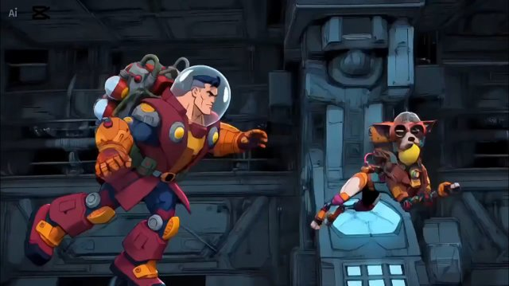

# 1990s American superhero cartoon（90 年代美式超英动画）

来源：网络

## 画面参考



## 美学提示词（英文）

```text
1990s American Saturday-morning action-cartoon look: thick confident black ink outlines, flat saturated colours with hard two-tone cel shadows, heavy spot blacks, square-jawed heroic caricature with broad chest and small waist.
Palette: #A8283A, #F08A24, #26303F, #57C7E3, #F5C842.
Bold graphic light/shadow separation, deep spot blacks, dramatic action poses, strong silhouettes and punchy limited-animation timing.
Negative: 3D render, soft watercolour, anime moe faces, photoreal, pastel palette.
```

## 美学提示词（中文）

```text
1990 年代美式周六早间动作动画质感：粗而自信的黑色墨线，饱和平涂颜色配硬边两阶赛璐珞阴影，大面积黑块，方下巴的英雄式漫画造型，宽胸细腰。
色板：#A8283A、#F08A24、#26303F、#57C7E3、#F5C842。
大胆图形化明暗分离、深黑块、戏剧化动作姿态、强剪影与有力有限动画节奏。
负面词：3D 渲染、柔和水彩、日式萌系脸、照片写实、粉彩色调。
```
