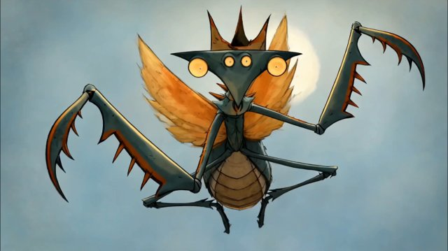

# Whimsical hand-drawn fantasy concept art, ink and watercolor illustration（奇趣手绘奇幻概念艺术，墨水 + 水彩）

来源：网络

## 画面参考



## 美学提示词（英文）

```text
Whimsical hand-drawn fantasy concept art in ink and watercolour: confident scratchy black ink contours, loose transparent watercolour washes with granulation and blooms, aged-paper texture, eccentric angular creature design.
Palette: #9DB3C4, #3F4B52, #D07A32, #B5603D, #E4D6B8.
Soft natural light, transparent watercolor layering, visible paper grain, eccentric silhouettes, expressive sketch-like motion.
Negative: 3D render, glossy CG, photoreal insects, flat vector, neon.
```

## 美学提示词（中文）

```text
墨水 + 水彩的奇趣手绘奇幻概念艺术：自信潦草的黑色墨线轮廓，松散透明的水彩晕染，带颗粒沉淀与水渍，做旧纸张质感，古怪又棱角分明的生物设计。
色板：#9DB3C4、#3F4B52、#D07A32、#B5603D、#E4D6B8。
柔和自然光、透明水彩层叠、可见纸纹、古怪剪影与富有表现力的速写式动作。
负面词：3D 渲染、光泽 CG、写实昆虫、扁平矢量、霓虹。
```
