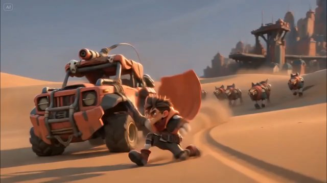

# Stylized 3D Animated Feature Film（风格化 3D 动画长片）

来源：网络

## 画面参考



## 美学提示词（英文）

```text
Stylized 3D animated feature-film look, high-end CG with soft subsurface skin, chunky exaggerated proportions, big hands and feet, spiky hair, expressive brows, readable silhouettes.
Palette: #D7A77A, #C45A32, #4C4F57, #9C9AB5, #E2A27F.
Low-angle golden-hour light, long cast shadows, atmospheric particles, cinematic motion blur and energetic camera movement.
Negative: 2D, painterly, photoreal humans, gore, flat lighting.
```

## 美学提示词（中文）

```text
风格化 3D 动画长片质感：高端 CG，柔和次表面皮肤，夸张厚实的比例，大手大脚，刺猬头，表情丰富的眉毛，剪影清晰。
色板：#D7A77A、#C45A32、#4C4F57、#9C9AB5、#E2A27F。
低角度黄金时刻光、长投影、空气粒子、电影动态模糊与高能量运镜。
负面词：2D、绘画感、写实人类、血腥、平光。
```
