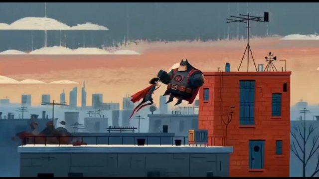

# Mid-Century Modern Editorial Illustration, Geometric Character Design（世纪中期现代社论插画 + 几何角色）

来源：网络

## 画面参考



## 美学提示词（英文）

```text
Mid-century modern editorial illustration with geometric character design, flat gouache-like colour blocks, subtle dry-brush and grain texture, simple shape-language characters built from rectangles, circles and triangles, almost no outlines.
Palette: #5D6F83, #B2492F, #E8A07A, #EDE1C8, #2E3238.
Flat warm illumination, layered planar parallax, lateral staging, geometric silhouette clarity and comic timing.
Negative: 3D render, realistic anatomy, glossy comic shading, anime, photoreal city.
```

## 美学提示词（中文）

```text
世纪中期现代社论插画 + 几何角色设计：类似水粉的平面色块，细微干刷和颗粒质感，用矩形、圆形、三角形搭建的简单造型语言，几乎不描边。
色板：#5D6F83、#B2492F、#E8A07A、#EDE1C8、#2E3238。
扁平暖光、平面层叠视差、侧面调度、清晰几何剪影与喜剧节奏。
负面词：3D 渲染、写实解剖、光泽漫画上色、日漫、写实城市。
```
