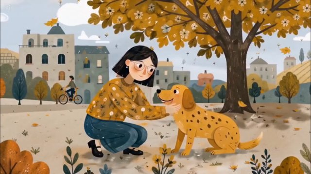

# Children's storybook / Warm Scandinavian Folk Illustration（温暖北欧民间绘本）

来源：网络

## 画面参考



## 美学提示词（英文）

```text
Warm Scandinavian folk picture-book illustration: hand-painted gouache with dry-brush and speckled grain, flat decorative shapes and small dot-and-leaf motifs; rounded faces, dot eyes, rosy cheeks and simple limbs.
Palette: #D39B2B, #C8642B, #4F6D73, #EFE6D5, #1F2A44.
Flat even light, centered decorative composition, warm muted colors, gentle bobbing movement and cozy folk warmth.
Negative: realistic lighting, 3D, anime, glossy, neon.
```

## 美学提示词（中文）

```text
温暖北欧民间绘本：手绘水粉、干刷与斑点颗粒，平面装饰造型、小圆点与叶片纹样；圆脸、豆豆眼、红脸颊和简单四肢。
色板：#D39B2B、#C8642B、#4F6D73、#EFE6D5、#1F2A44。
均匀平光、居中装饰构图、温暖柔和色彩、轻柔上下浮动动作与温馨民间暖意。
负面词：写实光影、3D、日漫、光泽感、霓虹。
```
