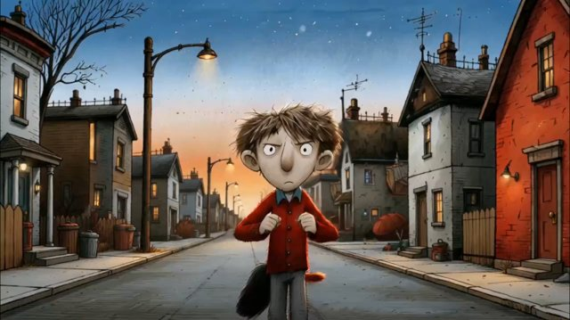

# Hand-drawn sketch（手绘素描）

来源：网络

## 画面参考



## 美学提示词（英文）

```text
Hand-drawn sketchbook picture-book illustration: scratchy black ink outlines, nervous hatching, colored-pencil and dry-brush texture over muted paint, wobbly perspective; gangly caricature proportions, oversized heads, wide round eyes with tiny pupils, thin elongated limbs and grotesque-cute silhouettes.
Palette: #2C3E5C, #E8894A, #A8432E, #8E8E86, #F4C26B.
Muted twilight tones with warm luminous accents, slightly unstable perspective, sketchy wide framing and whimsical eerie mood.
Negative: clean vector, glossy 3D, anime, bright saturated pastel.
```

## 美学提示词（中文）

```text
手绘速写本绘本插画：潦草黑墨线、神经质排线、柔和颜料上叠加彩铅与干刷质感，透视略晃动；瘦长漫画比例、大头、圆眼小瞳孔、细长四肢与怪萌剪影。
色板：#2C3E5C、#E8894A、#A8432E、#8E8E86、#F4C26B。
柔和暮色配暖发光点缀、略不稳定透视、速写宽幅构图与奇趣诡异氛围。
负面词：干净矢量、光泽 3D、日漫、明亮高饱和粉彩。
```
