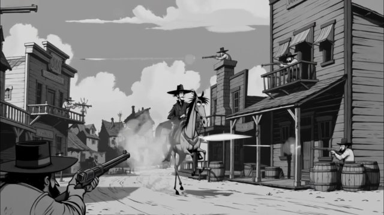

# 蒂姆·伯顿式黑白哥特风（Tim Burton-Inspired Gothic Ink Style）

来源：网络

## 画面参考



## 美学提示词（英文）

```text
Black-and-white ink illustration animation with gothic-whimsical caricature proportions: spindly elongated limbs, tiny waists, oversized heads, sunken eyes and crooked silhouettes; clean bold ink outlines, gray-wash tonal shading, strictly achromatic color and subtle paper grain.
Palette: #121212, #3A3A3A, #8A8A8A, #CFCFCF, #F2F2F0.
Strict grayscale, high-contrast graphic daylight, dusty atmospheric texture, dramatic foreground framing and dark comic suspense.
Negative: colour, 3D render, photoreal, anime, soft pastel watercolour.
```

## 美学提示词（中文）

```text
黑白墨线动画，哥特奇趣漫画比例：细长四肢、极细腰、超大脑袋、深陷眼睛与歪扭剪影；干净粗犷墨线、灰色淡彩明暗、纯灰阶和细微纸张颗粒。
色板：#121212、#3A3A3A、#8A8A8A、#CFCFCF、#F2F2F0。
严格灰阶、高对比图形日光、尘状空气纹理、戏剧化前景构图与暗黑喜剧悬念。
负面词：彩色、3D 渲染、照片写实、日漫、柔和粉彩水彩。
```
